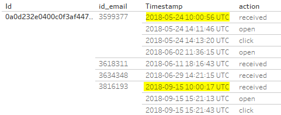
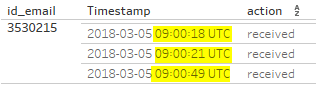
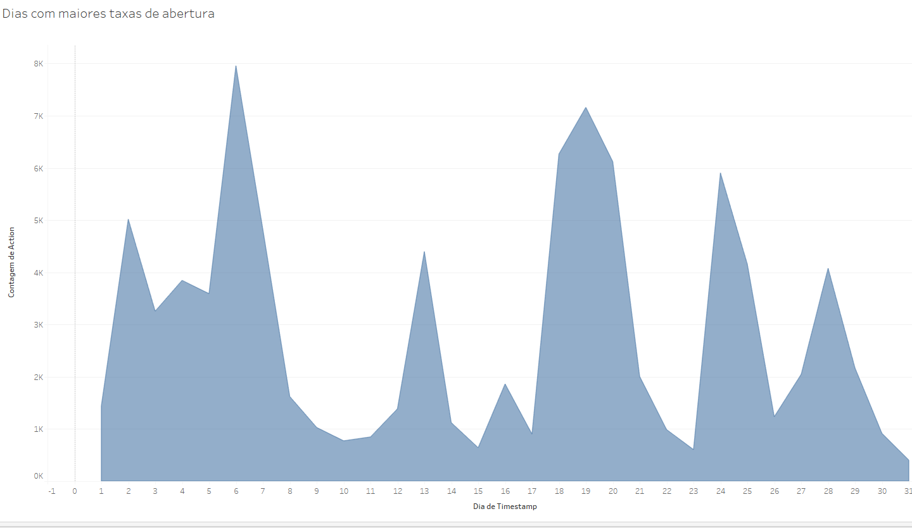
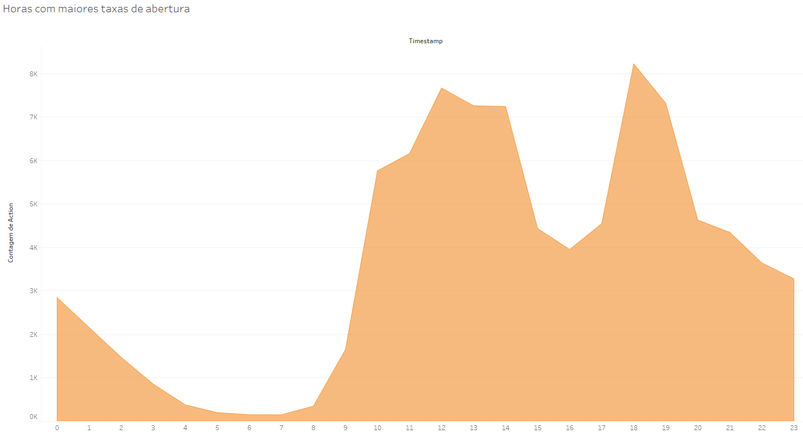

# ditoChallenge
<i>Data Scientist at Dito</i>

Deixarei nesse README.md um passo a passo de como cheguei nas repostas do desafio. Dentro do reposisitório deixarei os códigos finais que foram utilizados para responder aos desafios. Serei breve como pedido =)

## Desafio 01 - pt.1
Na primeira parte do primeiro desafio a primeira coisa que eu fiz foi querer visualizar todos os dados que eu tinha a disposição, apenas para visualizar o que já foi explicado no enunciado, então eu realizei um ``SELECT *``

Depois de analisar bem percebi que a primeira coisa que eu precisaria é pegar o id das 5 pessoas que mais compraram, então eu realizei uma busca da soma dos gastos agrupado pelo id:

```
SELECT SUM(properties.revenue) revenue, id
FROM `dito-data-scientist-challenge.tracking.dito`
GROUP BY id
ORDER BY revenue DESC
LIMIT 5
```
A partir disso ficou simples, eu precisaria fazer um JOIN na própria tabela, tranformando essa primeira busca em uma tabela chamada ``maioresCompradores``, agora só precisava buscar os dados necessários, com isso eu fiz:

```
SELECT maioresCompradores.revenue, maioresCompradores.id, dados.traits.name nome, dados.traits.email email, dados.traits.phone telefone, dados.timestamp atualizacao
FROM (SELECT SUM(properties.revenue) revenue, id
FROM `dito-data-scientist-challenge.tracking.dito`
GROUP BY id
ORDER BY revenue DESC
LIMIT 5) as maioresCompradores
JOIN `dito-data-scientist-challenge.tracking.dito` dados ON maioresCompradores.id = dados.id
```
A partir daqui eu tinha tudo que precisava para realizar a finalização do exercício onde resultou no arquivo: ``desafio01_pt1 - Resposta Incompleta.sql``

Porém o ``timestamp`` tinha muitos regitros de alteração, inclusive os ``NULL``, pois não significa que uma pessoa sempre atualizava todos os dados, e eu precisava apenas dos dados mais atualizados, para isso eu fiz o seguinte, criei dois ``SELECT`` para cada item que eu precisava mais atualizado (email, nome e telefone) sendo um ``SELECT`` apenas para pegar a data mais recente onde tinha disponível o registro e o outro para pegar os dados dessa data (resultando em 2 ``SELECT`` para cada item), agora só precisava apelidar cada ``SELECT`` como uma tabela utilizando o ``WITH``, para facilitar na leitura e organização, e depois ligar elas pelo id =). 
Resultando o arquivo ``desafio01_pt1 - Resposta Completa.sql``.

Fazendo isso, obtive o resultado, em ordem de quem mais gasta para o menor:

|Nome|Email|Telefone|
|----|-----|--------|
|Heloísa Ordonhes|joshua_prosacco@gmail.com|(51) 91972-9639|
|Mirella Soares|velia.pagac@hotmail.com|(43) 97290-9288|
|Fernanda Resende|charlott.ledner@live.com|(33) 92311-0450|
|Sophie Banheira|fransisca.predovic@bol.com.br|(24) 91404-3805|
|Alícia Pinheira|bill@bol.com.br|(51) 91012-4779|
## Desafio 01 - pt.2
Para esse desafio eu interpretei de duas formas diferentes o enunciado, pelo motivo de que : Perguntou geralmente de quantos em quantos dias em média as pessoas realizam compras. Mas não sabia se deveria considerar mais de uma compra por dia, ou se só importava os dias em que ele comprou, idependente do quanto de compras ele fez. Então na dúvida, fiz das duas formas diferentes.

|Forma 1|Forma 2|
|-------|-------|
|Mediana = 1.0|Mediana = 2.7
|Arquivo = desafio01_pt2 - Forma 1|Arquivo = desafio01_pt2 - Forma 2
#### Forma 1 - Cosiderando mais de uma compra por dia
Essa primeira forma não é a que eu acho que interpreta o enunciado.

- O primeiro passo a ser feito foi selecionar o ID de todos os usuários que compraram algo, idependente de quanto compraram;
- Depois eu precisava calcular a diferença de datas da primeira compra de um usuário utilizando o ``MAX(timestamp)`` e a última utilizando o ``MIN(timestamp)``. Para isso eu utilizei a função ``TIMESTAMP_DIFF`` e como referência ``day`` para calcular a diferença de dias;
- Após isso realizei um ``COUNT`` de quantas vezes a pessoa fez compras nesse intervalo de tempo dela. Depois fiz a divisão do número do intervalo de dias pelas compras;
- No final eu tinha a média de todos os usuários, após isso eu apenas peguei a mediana utilzando o ``APPROX_QUANTILES(media,1000)[OFFSET(500)]``.

#### Forma 2 - Cosiderando apenas os dias (sem quantidade)

Essa forma é a que eu acho que interpreta melhor o enunciado.

Eu consegui reutilizar boa parte da primeira forma, basicamente nessa forma eu não precisarei saber quantos produtos  usuário comprou, precisarei saber apenas em quantos dias no total do intervalo ele tinha realizado uma compra.

- Reutilizo o primeiro e o segundo passo da primeira forma;
- Em vez de realizar o ```COUNT``` de quantas vezes os usuários realizaram contas, eu tivede realizar um count das datas de compra de um usuário, utilizando um ``GROUP BY``;
- Por isso tive que criar 2 ``SELECT``'s, um para converter o timestamp em data, pois pode ter pedidos no mesmo dia e em horários diferente, e um ``SELECT`` apenas para realizar o ``COUNT`
- Com isso eu tinha a média de todos os usuários, após disso foi só eu ter pego a mediana.

## Desafio 02 

Para esse desafio eu utilizei o ``pyhton`` com a importação da biblioteca ``csv``.
Para inicializar o trabalho eu importei a tabela para visualizar as colunas:
```
data = pd.read_csv('sto_challenge.csv')
print(data.info())
```
Depois criei uma função para adicionar as colunas de uma lista em outra lista, na mesma ordem

```
def column_to_list(data, index):
    column_list = [column[index] for column in data]
    return column_list
```
Depois eu fiz um contador, para ver quantas actions de cada tipo eu tinha:
 
```
received:  213183
open:  88599
click:  13277
unsubscribe:  838
spamreport:  101
```
 
 E com isso fiz o cálculo de abertura, para ver quanto é hoje essa taxa:
```
taxa_abertura = open/received
taxa_abertura = 0.42
```
Para analisar os dados com gráficos melhores desenhados eu utilizei a ferramenta Tableau.

Eu tive que realizar um pequeno estudo para aprofundar um pouco em Send Time Optimization e entendi que para aumentar o mesmo, 
é preciso analisar o que causa as pessoas não abrirem o e-mail, sendo:

- O usuário receber e-mails em horários distintos.

Solução para isso, temos que analisar qual o horário do envio do e-mail em que ele está abrindo, e manter esse horário para todos os outros
emails, assim podemos resultar uma maior taxa de abertura

Com o Tableau eu percebi que um mesmo único usuário ele recebe muitos e-mails.
Porém ele abre apenas 2 de 4. Como segue o exemplo abaixo:



Podemos visualizar nesse usuário que o melhor horáio para aumentar a taxa de abertura dele é se
enviarmos o e-mail às 10:00 da manhã

É melhor analisar usuário a usuário, para aumentar exponencialmente a taxa de abertura em vez de
generalizar por dia da semana que mais se abrem e-mails ou dias dos meses ou meses no ano.

Analisando por id_email podemos ver que o e-mail é enviado ao mesmo tempo para todos os usuários(a maioria),
isso é uma das causas da baixa taxa de abertura, segue:



Agora, quando chegar um usuário novo, até estudarmos o comportamento dele, aí sim, devemos generalizar um horário e dia em que existe uma maior taxa de abertura,
quando visualizarmos o horário em que ele abre o e-mail, começamos a mandar o e-mail para ele
próximo daquele horário, maximizando a taxa de abertura. Encaixando assim ele com os outros 
usuários.

Para isso criei um gráfico no Tableau onde fiz um contagem de ``Action = Open`` por dia do mês e podemos
verificar que os dias que tem a maior taxa de abertura:



Agora, caso seja um evento semanal ou algo do tipo, podemos analisar pela hora com maior taxa
de abertura:



#### Conclusão Final - Desafio 02

Sobre o STO, é algo que realmente é preciso, a taxa de abertura realmente é importante, depois de analisar os dados,
é preciso pensar em uma forma de implementar isso que maximize a taxa de abertura. Uma forma de podermos implementarmos isso, acho que a mais válida, seria com machine learning.
Onde estudaríamos o perfil do usuário, inicialmente lançando ele em um padrão da maioria, para aumentar as chances de acertarmos 
de primeira a melhor hora pra ele. E a partir disso, sempre estarmos de acordo com o comportamento do usuário.
Quanto mais e-mails enviarmos, mais usuários termos cadastrados para o STO, mais preciso vai estar nosso método
da maximização da taxa de abertura.
